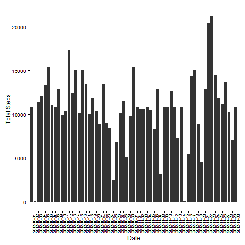

Basic settings


```r
echo = TRUE
```


## Load data into R

```r
df<-read.csv("~/R/reproducible research/activity.csv")
```
## What is mean total number of steps taken per day?

### Calculate the mean and Median total number of steps taken per day

```r
SumByDate<-aggregate(steps~date,data=df,sum)
MeanSteps<-mean(SumByDate$steps)
MedianSteps<-median(SumByDate$steps)
MeanSteps
```

```
## [1] 10766.19
```

```r
MedianSteps
```

```
## [1] 10765
```
### histogram of the total number of steps taken each day

```r
hist(SumByDate$steps, names.arg =SumByDate$date, xlab = "Date", ylab = "Steps", main = "Total number of steps taken each day")
```

```
## Warning in plot.window(xlim, ylim, "", ...): "names.arg" is not a graphical
## parameter
```

```
## Warning in title(main = main, sub = sub, xlab = xlab, ylab = ylab, ...):
## "names.arg" is not a graphical parameter
```

```
## Warning in axis(1, ...): "names.arg" is not a graphical parameter
```

```
## Warning in axis(2, ...): "names.arg" is not a graphical parameter
```

 
## The average daily activity pattern
### The average daily activity pattern plot

```r
p1<-aggregate(steps~interval,data=df,mean)
library(ggplot2)
P1<-ggplot(p1,aes(x=interval,y=steps))+
    geom_line()+xlab("Interval [min]")+ylab("Average Steps")+
    theme_bw()+
    theme(panel.grid.major=element_blank(),panel.grid.minor=element_blank())
P1
```

 

```r
ggsave(P1,file="P1.pdf",width=8,height=5)
dev.off()
```

```
## null device 
##           1
```

### The following 5-minute interval, on average across all the days in the dataset, contains the maximum number of steps


```r
MaxSteps<-p1$interval[order(-p1$steps)][1]
MaxSteps
```

```
## [1] 835
```

## Imputing missing values

### Calculate and report the total number of missing values in the dataset 

```r
totalNA<-sum(is.na(df$steps))
totalNA
```

```
## [1] 2304
```

### filling in all of the missing values in the dataset

```r
NArep<-merge(df,p1,by="interval")
NArep$steps.x[is.na(NArep$steps.x)]=NArep$steps.y[is.na(NArep$steps.x)]
```

### Make histogram of the total number of steps taken each day.and Calculate and report the mean and median total number of steps taken per day


```r
p2<-aggregate(steps.x~date,data=NArep,sum)
P2<-ggplot(p2,aes(x=date,y=steps.x))+
    geom_bar(stat="identity")+xlab("Date")+ylab("Total Steps")+
    theme_bw()+
    theme(panel.grid.major=element_blank(),panel.grid.minor=element_blank(),axis.text.x  = element_text(angle=90, size=8))
  
P2
```

 

```r
ggsave(P2,file="P2.pdf",width=10,height=7)
dev.off()
```

```
## null device 
##           1
```
### Calculate and report the mean and median total number of steps taken per day


```r
MeanStepsNA<-mean(p2$steps.x)
MedianStepsNA<-median(p2$steps.x)
MeanStepsNA
```

```
## [1] 10766.19
```

```r
MedianStepsNA
```

```
## [1] 10766.19
```
The new mean (w/ NA filled) per day is the same as the old mean. The new median is greater than the old median.

## The differences in activity patterns between weekdays and weekends

### Create a new factor variable in the dataset with two levels - "weekday" and "weekend" 

```r
NArep$day<-as.POSIXlt(NArep$date)$wday
NArep$day[NArep$day %in% c(0, 6) ] <- "weekend"
NArep$day[NArep$day %in% c(1:5) ] <- "weekday"

StepsWeekday <- tapply(subset(NArep, day=="weekday")$steps.x, subset(NArep, day=="weekday")$interval, mean)
StepsWeekend <- tapply(subset(NArep, day=="weekend")$steps.x, subset(NArep, day=="weekend")$interval, mean)
```

### The panel plot containing a time series plot (i.e. type = "l") of the 5-minute interval (x-axis) and the average number of steps taken, averaged across all weekday days or weekend days (y-axis). 

```r
par(mfrow = c(2, 1))
plot(StepsWeekday, type="l", xlab="interval", ylab="Number of steps", main="weekdays")
plot(StepsWeekend, type="l", xlab="interval", ylab="Number of steps", main="weekend")
```

 
